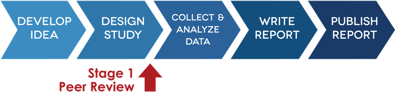

```{r setup, include=FALSE}
  # "`r parse(text=paste('20^text', ' May 2021'))`"
knitr::opts_chunk$set(echo = FALSE,
                      message=FALSE, 
                      warning=FALSE)
# download.file("https://drive.google.com/uc?export=download&id=1wuMqL_Z8T9rxuGvn0VP6siag90kHDm2O",
#               "www/references.bib", overwrite = T)
library(fontawesome)
#`r fa(name = "map-signs", fill="grey", width = "20px")`
```


## Registered Reports | Was sind RR?

__Klassisches Publikationsformat:__  
  
  
<span class="mysource">([cos.io/rr](https://www.cos.io/rr))</span>  
  
<span class="mysource">[@chambersetal.2014]</span>

## Registered Reports | Was sind RR?

__Registered Report:__  
  
  
<span class="mysource">([cos.io/rr](https://www.cos.io/rr))</span>  
  
<span class="mysource">[@chambersetal.2014]</span>

## Registered Reports | Was sind RR?

__Registered Report:__  
  
  
<span class="mysource">([cos.io/rr](https://www.cos.io/rr))</span>  
  
<span class="mysource">[@chambersetal.2014]</span>


## Registered Reports | Warum RR?


<div class="container">

<div class="box60">
{width=90%}
</div>

<div class="box40">
__Questionable Research Practices__  

* Selektives Berichten (AVs, Bedingungen, Studien)
* Sequenzielle Datenerhebung/ Optionales Stoppen
* Exkludieren von Fällen
* HARKing
* Exploration als Konfirmation markieren
* ...

<span class="mysource">[@johnetal.2012; @simmonsetal.2011]</span>
</div>
</div>


## Registered Reports | Wo?


__Zeitschriften__ (beispielhaft):

* Learning and Instruction
* British Journal of Educational Psychology 
* Frontiers in Education
* Journal of Educational Psychology
* Zeitschrift für Bildungsforschung
* ...

Für eine vollständigere Liste: [cos.io/initiatives/registered-reports](https://www.cos.io/initiatives/registered-reports)


## Registered Reports | Tipps & Guidelines

<div class="container">
<div class="box40">
\
\

* Checkliste für eine erfolgreiche Einreichung: [osf.io/93znh/](https://osf.io/93znh/)

\
\
\

* "Practical Considerations" <br /><span class="mysource">[@kiyonagaetal.2019]</span>

</div>

<div class="box60" style="margin-top:-18%; padding-left:10%">
{width=100%}
</div>
</div>


## Publikation & Evaluation entkoppeln | Was?

__Klassisch__

* Zeitschrift: Publikation & Evaluation

\
\

__Entkopplung__

* direkte Publikation des Artikels (über Zeitschrift oder Repository)<br /><br />
* Evaluation des Manuskripts 
    - durch Zeitschriften (potentiell auch mehrere)
    - durch Review Services

## Publikation & Evaluation entkoppeln | Warum?

\

* File-drawer effect <br /><span class="mysource">[@rosenthal.1979]</span><br /><br /><br />
* Publikationszeiten verkürzen <br /><span class="mysource">[z.B. bei Arbeit unter Zeitdruck während einer Pandemie; @kwon.2020]</span>

## Publikation & Evaluation entkoppeln | Wie?

<div class="container">
<div class="box49">
__Publikation von Preprints__  
  
[{width=75px}](https://osf.io/preprints/socarxiv)  
  
[{width=300px}](https://psyarxiv.com/)  
  
[{width=300px}](https://www.psycharchives.org/)
</div>

<div class="box49">
__Review__  

[{width=300px}](https://www.scienceopen.com/)  

</div>
</div>

## &nbsp;

<div id="sci-op1"></div>

## &nbsp;

<div id="sci-op2"></div>


## Open Peer Review | Was?

Merkmale:  

* __Identitäten__ der Reviewer\*innen/ Autor\*innen offen
* __Inhalte__ der Reviews offen
* __Antworten__ der Autor\*innenen offen
* offen für erweiterte __Community__
* __Zeitpunkt__ offen


## Open Peer Review | Warum?

__Vorteile__

* Anerkennung der Leistung für Reviewende (Anreizstrukturen)
* potenzielle konkurrierende Interessen/ biased gatekeeping leichter erkennbar
* Schnelligkeit der Dissemination (preprint oft nicht möglich bei blind review) <span class="mysource">[@wang.2016]</span>

\

__Unklar__

* Qualität des Feedbacks?
    - Keine Unterschiede in Review-Qualität, Review-Empfehlung und Zeit der Anfertigung des Reviews <span class="mysource">[signed review: @vanrooyenetal.1999; öffentliches posten: @vanrooyenetal.2010]</span><br /><br />
    - Höhere Qualität, konstruktiver, längere Bearbeitungszeit, Review-Empfehlnug tendenziell positiver <span class="mysource">[@walshetal.2000]</span>


## Open Peer Review | Warum?

__Nachteile__

* fehlende Standards
* Geringere Reviewquote <span class="mysource">[@vanrooyenetal.1999]</span>
* negative Folgen kritischer Gutachten ggü. etablierten Forscher*innen?


## Open Peer Review | Beispiele

__Collabra: Psychology__:  
Veröffentlichung der double-blind Reviews ohne Namen der Reviewenden bei Publikation (Supplemental Material)
\
\

__PLOS ONE/ Frontiers in Education__:  
Kommentierung durch Peers (Kommentarfunktion)
\
\

__F1000__: 

* Veröffentlichung der "signed" Reviews 
* Veröffentlichung der Antworten
* Kommentierung durch Peers


## &nbsp;

<div id="opr"></div>
<span class="mysource" style="position:absolute; top:97%; left: 85%">[(Aleksic et al., 2015)](https://f1000research.com/articles/3-271/v2)</span>


# {-}


<div id="refs"></div>


# &nbsp;
__Images__  
(in order of appearance)  
  
<span style="font-size:.7em;">
title page | <a href="https://unsplash.com/@jessbaileydesigns?utm_source=unsplash&utm_medium=referral&utm_content=creditCopyText">Jess Bailey</a> on <a href="https://unsplash.com/?utm_source=unsplash&utm_medium=referral&utm_content=creditCopyText">Unsplash</a>  
icons | [fontawesome.com CC-BY 4.0](https://fontawesome.com/license/free) (icons used throughout the slides)   

</span>
\
\
\
\
\
\
\
\
\

__License__  
<span style="font-size:.7em;">
<a rel="license" href="http://creativecommons.org/licenses/by-sa/4.0/"></a><br />This work is licensed under a <a rel="license" href="http://creativecommons.org/licenses/by-sa/4.0/">Creative Commons Attribution-ShareAlike 4.0 International License</a>.
</span>